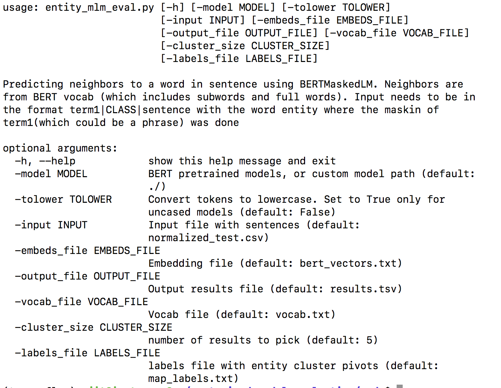

# pretrained_model_evaluation

Details of the pre-training evaluation as well pre-training tips in [the medium post](https://towardsdatascience.com/quantitative-evaluation-of-a-pre-trained-bert-model-73d56719539e) 

# Installation
Setup pytorch environment with/without GPU support using [link](https://github.com/ajitrajasekharan/multi_gpu_test)

# Usage

# Results

# License

MIT License
