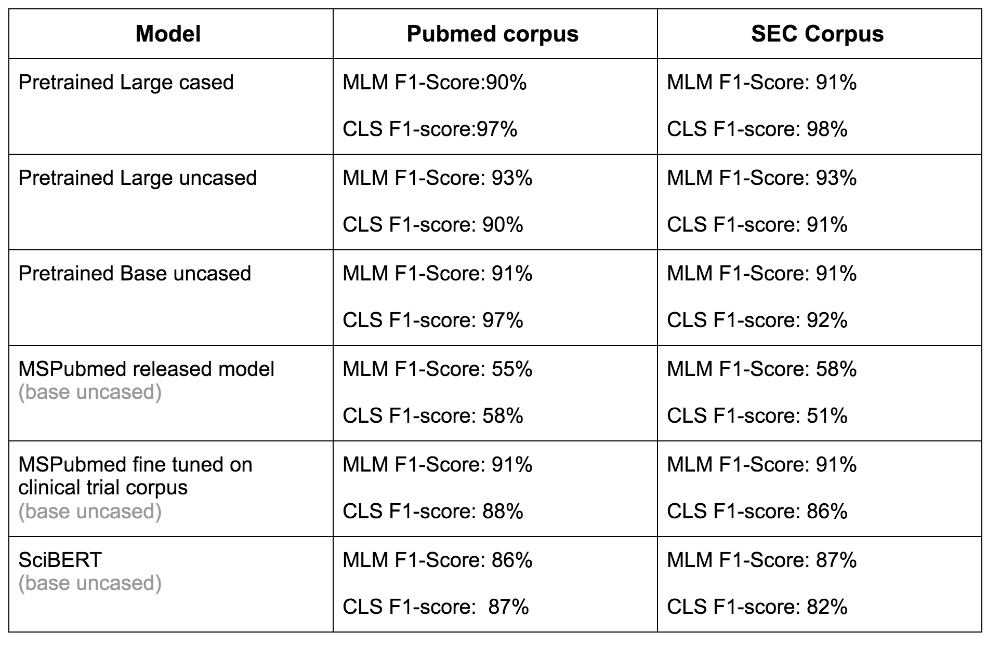

## pretrained_model_evaluation

Details of the pre-training evaluation as well pre-training tips in [the medium post](https://towardsdatascience.com/quantitative-evaluation-of-a-pre-trained-bert-model-73d56719539e) 

## Installation
Setup pytorch environment with/without GPU support using [link](https://github.com/ajitrajasekharan/multi_gpu_test)


## Step 1. Corpus pre-processing for sentence boundary detection

Use [this repository code](https://github.com/ajitrajasekharan/simple_sbd.git) for sentence boundary detection

Perform sentence boundary detection using script bert_sbd.py. It filters out lines less than min_words (3) and > max_words (word not characters)
Then “tr” the output to lowercase approx. This is only required for uncased model pretraining.

*Example:*
```
 python bert_sbd.py -input pubmed.txt -single True  | tr 'A-Z' 'a-z' > combined.txt 
```


## Results



## License

MIT License
